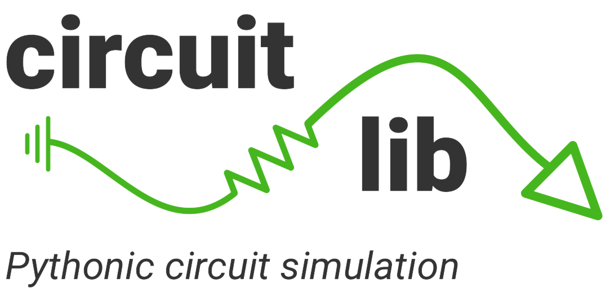
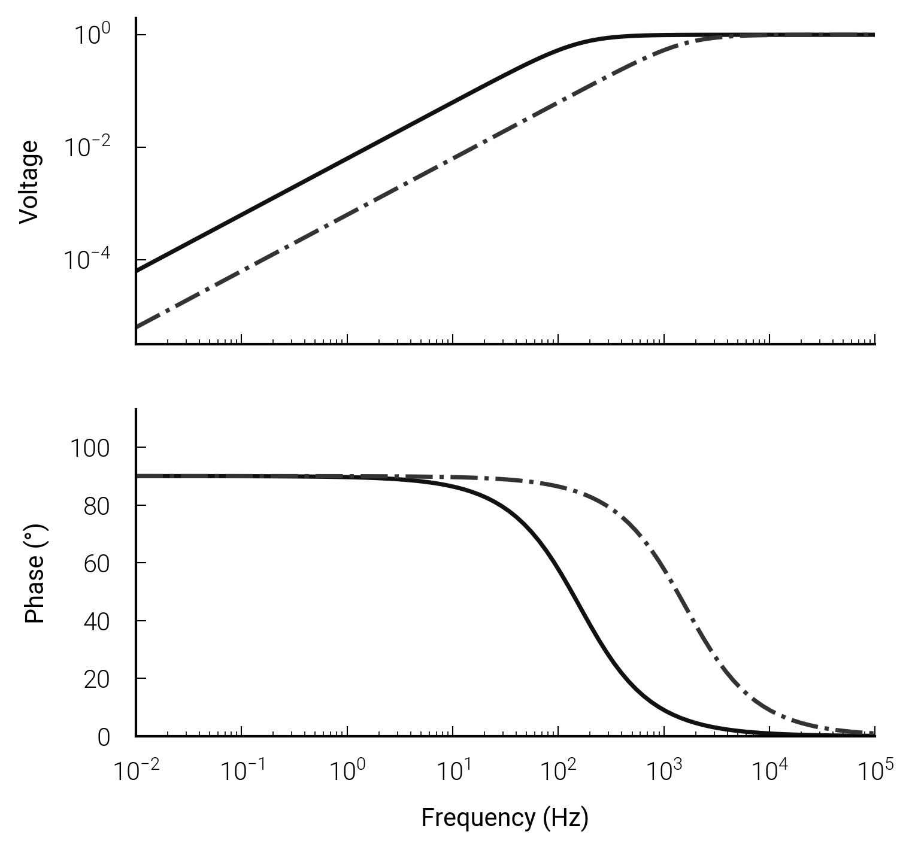

<p align="center">

</p>


# Getting started

Circuitlib allows quick and easy analysis of electrical circuits.  It is written exclusively in<br/>
Python and only requires NumPy and Matplotlib. Circuits can be constructed<br/>
in decorated functions or with SPICE style netlists. Look how easy it is...

```python

import numpy as np
import circuitlib as clb

freq = np.logspace(-2,5,100)

@clb.NodalAnalysis(freq)
def highpass_filter(V=1, C=100e-12, R=1000):
    return V + C + R

fra = clb.FrequencyAnalysis(highpass_filter)
ax = fra.bode()
ax = fra.bode(C=400e-12, ax=ax)  # modify component values on the fly
```



# Installation

Circuitlib can be installed with pip:
```
$ pip install circuitlib
```

Or grab the source code from GitHub:
```
$ git clone git://github.com/circuitlib/circuitlib.git
$ python setup.py installation
```
